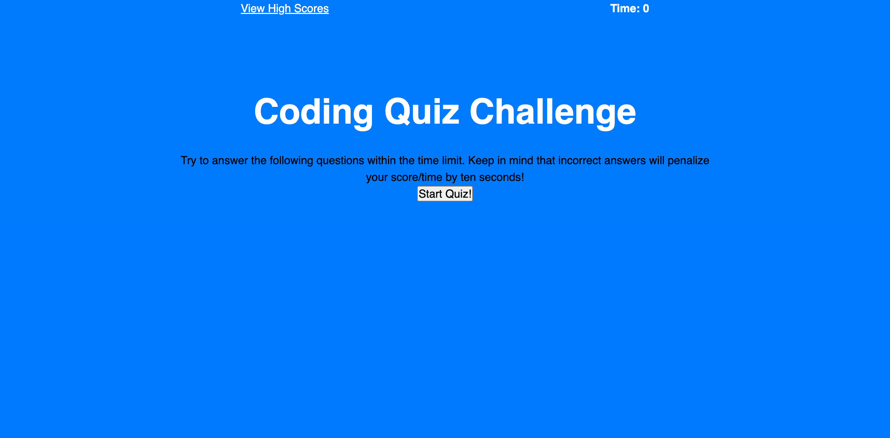
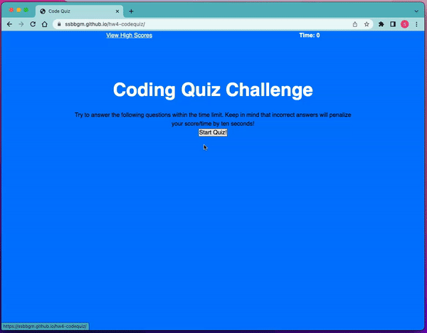

# Code Quiz

# DESCRIPTION

THis is a web-code quiz on JavaScript concepts. The player starts the game and is then presented with questions to test their skills. Once the game ends, they can see if they beat the high score.

## VISUALS






## POINTS OF INTEREST

```
GIVEN I am taking a code quiz
WHEN I click the start button
THEN a timer starts and I am presented with a question
WHEN I answer a question
THEN I am presented with another question
WHEN I answer a question incorrectly
THEN time is subtracted from the clock
WHEN all questions are answered or the timer reaches 0
THEN the game is over
WHEN the game is over
THEN I can save my initials and my score
```
    
[Get ready to play!](https://media.giphy.com/media/Ws4gfyK51QwQTYpNCO/giphy.gif) 

## CONTRIBUTORS

 


## DEPLOYED APPLICATION

https://ssbbgm.github.io/codequiz/

